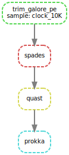
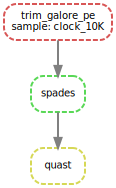

# Snakemake workflow: Raw-Illumina-Pipeline

[](https://snakemake.github.io)
[](https://github.com/currocam/RawIlluminaPipeline/actions?query=branch%3Amain+workflow%3ATests)


A Snakemake workflow for raw illumine reads to draft assemblies and annotations

## Usage
### Creating an environment from an environment.yaml file

First, make sure to activate the conda base environment with
``` bash
conda activate base
```

The environment.yaml file can be used to install all required software into an isolated Conda environment with the name snakemake-RawIlluminaPipeline via
``` bash
mamba env create --name snakemake-RawIlluminaPipeline --file environment.yaml
```
O, using conda: 
``` bash
conda env create --name snakemake-RawIlluminaPipeline --file environment.yaml
```

To activate this environment, use
``` bash
conda activate snakemake-RawIlluminaPipeline
```

To deactivate an active environment, use

``` bash
conda deactivate
```

### Running the pipeline with toy data

The input data must meet the following requirements: be inside the `reads/` folder and be named consistently with the following scheme: 

```bash
ls reads
#clock_10K.1.fastq.gz  clock_10K.2.fastq.gz
```
In this case, the sample identifier is `clock_10K`.

We can, by executing the following command, draw the workflow to be followed: 

```bash
snakemake --dag results/clock_10K_prokka | dot -Tsvg > docs/dag_prokka.svg
``` 


To actually run it, we have to indicate the number of cores we are going to dedicate to it:

```bash
snakemake results/clock_10K_prokka --cores 8
```
Note that the input file is not indicated, but **the output file**. To run the complete pipeline, we indicate that we want to get the `results/{sample}_prokka` file, where `sample` is `clock_10K`.

In case we only want to evaluate the genome assemblies using quast, we simply launch the following command: 

```bash
snakemake results/clock_10K_quast --cores 8
```


### Setting up the pipeline

A yaml configuration file is used to configure the pipeline. To run the pipeline with a custom configuration file, you can run it with the `--configfile` flag.

```bash
snakemake results/clock_10K_quast --cores 8 --configfile config/config.yaml
```
For more information on how to write this configuration file, see here [here](config/README.md). 

### Exploring the resulting files

The resulting files are stored in the `/results` directory.

```bash
tree results 
results
├── clock_10K_prokka
├── clock_10K_quast
├── clock_10K_spades
└── trimmed
    ├── clock_10K.1.fastq.gz_trimming_report.txt
    ├── clock_10K.1_val_1.fq.gz
    ├── clock_10K.2.fastq.gz_trimming_report.txt
    └── clock_10K.2_val_2.fq.gz
19 directories, 144 files
```

And the log files in the `/logs` directory

```bash
tree logs
logs
├── prokka
│   └── clock_10K.log
├── quast
│   └── clock_10K.log
├── spades
│   └── clock_10K.log
└── trim_galore
    └── clock_10K.log
```

